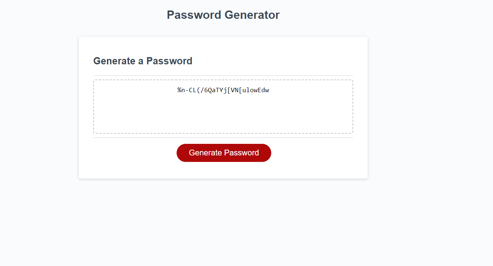

# password-generator-pedro-guerra

## Description

In this bootcamp challenge, the main goal is to build on a JavaScript code that has already been started a little bit. The main focus of this challenge will be to enhance JavaScrip coding skills, precisely on conditional statements. If the password generator is coded successfully, the user should be able to choose between having password that include or do not include: lowercase characters, special characters, numbers, and uppercase characters. On the screenshot below, I have displayed a password that contains all possible inputs.

## Installation

N/A

## Usage

This challenged allowed me to improve my JavaScript coding skills, as I was given a starter code with almost nothing inside of the JavaScript file, and had to develop a working password generator with multiple conditional statements.

Deployed Website Link: <a href="https://pguerra98.github.io/password-generator-pedro-guerra/">Deployed Website Link</a>

## Credits

Google Images (for project backgrounds)

## License

MIT License